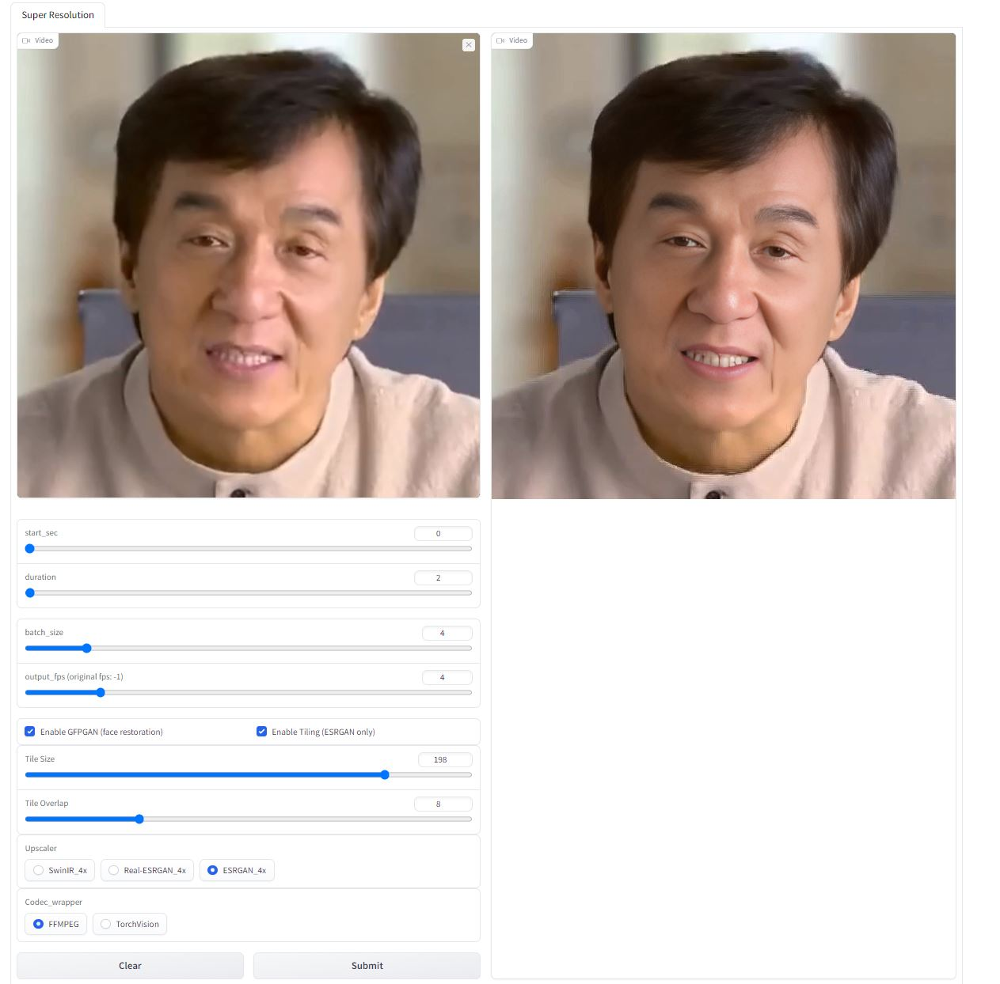

<a name="readme-top"></a>

<div align="center">

[![Contributors][contributors-shield]][contributors-url]
[![Forks][forks-shield]][forks-url]
[![Stargazers][stars-shield]][stars-url]
[![Issues][issues-shield]][issues-url]

</div>

<div align="center">
  <a href="https://github.com/dr413677671/super-video-super-resolution">
    
  </a>
  <h3 align="center">Super Video SR</h3>
  <p align="center">
    Video super-resolution web app
    <br />
    <a href="https://www.youtube.com/watch?v=d7sGUaHfEKQ"><strong>Watch demo »</strong></a>
    <br />
    <br />
    <!-- <a href="https://www.youtube.com/watch?v=9U6-moIJUkk">Video</a>
    · -->
    <a href="https://github.com/dr413677671/super-video-super-resolution/issues">Report Bug</a>
    ·
    <a href="https://github.com/dr413677671/super-video-super-resolution/issues">Request Feature</a>
  </p>
</div>

<!-- TABLE OF CONTENTS -->
<details>
  <summary>Table of Contents</summary>
  <ol>
    <li>
      <a href="#about-the-project">About The Project</a>
      <ul>
        <li><a href="#built-with">Built With</a></li>
      </ul>
    </li>
    <li>
      <a href="#getting-started">Getting Started</a>
      <ul>
        <li><a href="#prerequisites">Prerequisites</a></li>
        <li><a href="#installation">Installation</a></li>
      </ul>
    </li>
    <li><a href="#usage">Usage</a></li>
    <li><a href="#contact">Contact</a></li>
    <li><a href="#acknowledgments">Acknowledgments</a></li>
  </ol>
</details>

<div align=center>

</div>

## About The Project

Video super-resolution webapp. Fastest and powerful. Support Real-ESRGAN, ESRGAN, SWINIR, GFPGAN.

> :leopard: Good news: we now support restormer~

## Feature:
- [x] Model
    - [x] SWINIRx4
    - [x] RealESRGANx4
    - [x] ESRGANx4
    - [x] GFPGAN (Face Restoration)
    - [x] Restormer (motion deblur and etc.)
    - [ ] RealESRGANx4-TRT
    - [ ] RealBasicVSR
- [x] Inference Speed-up 
    - [x] Batchsize adjustment (fast)
- [x] Codec Framework
    - [x] FFMPEG streaming
    - [x] TorchVision
    - [ ] FFMPEG c++ backend
- [x] others 
    - [x] Frame interpolation (customize FPS)
    - [x] Tiling
    - [ ] IDR-only SR
    - [ ] Live Streaming

<p align="right">(<a href="#readme-top">back to top</a>)</p>

### Built With

* [![Pytorch][Pytorch]][Pytorch-url]
* Gradio
* Onnxruntime

<p align="right">(<a href="#readme-top">back to top</a>)</p>

## Getting Started


### Prerequisites

> Clone Prompt-Gallery extension.

  ```sh
  git clone https://github.com/dr413677671/super-video-super-resolution.git
  ```
**For ESRGAN you need to install CUDA>>**

**It would be extreamly slow if you dont have cuda anyway>>**

### Installation

  ```sh
  pip install <repo-directory>/requirements.txt
  ```
  Install FFMPEG.
  
## Usage

<!-- View the video tutorial:
<a href="https://www.youtube.com/watch?v=9U6-moIJUkk">View Demo</a> -->
  ```sh
  python3 <repo-directory>/app.py
  ```
> Visit http://127.0.0.1:7860 in browser, checkout ./output and ENjoy !   ๐•ᴗ•๐>


<!-- CONTACT -->
## Contact

[](https://github.com/https://github.com/dr413677671) &nbsp;&nbsp; [](https://www.youtube.com/channel/https://www.youtube.com/@randuan9718/videos) &nbsp;&nbsp; [](https://www.zhihu.com/people/kumonoue)  

<!-- ACKNOWLEDGMENTS -->
## Acknowledgments

Based on these brilliant repos:
* [stable-diffusion-webui](https://github.com/AUTOMATIC1111/stable-diffusion-webui)
* [Real-ESRGAN](https://github.com/xinntao/Real-ESRGAN)
* [Real-ESRGAN-GUI](https://github.com/net2cn/Real-ESRGAN_GUI)
* [SwinIR](https://github.com/JingyunLiang/SwinIR)
* [GFPGAN]( https://github.com/TencentARC/GFPGAN)
* [Restormer](https://github.com/swz30/Restormer)
* [Swin2SR](https://github.com/mv-lab/swin2sr)
* [Gradio](https://github.com/gradio-app/gradio)
* [FFmpeg](https://github.com/FFmpeg/FFmpeg)
* Logo genetrared by [Stable-Diffusion](https://github.com/CompVis/stable-diffusion)

<p align="right">(<a href="#readme-top">back to top</a>)</p>

<!-- MARKDOWN LINKS & IMAGES -->
<!-- https://www.markdownguide.org/basic-syntax/#reference-style-links -->
[contributors-shield]: https://img.shields.io/github/contributors/dr413677671/super-video-super-resolution.svg?style=for-the-badge
[contributors-url]: https://github.com/dr413677671/super-video-super-resolution/graphs/contributors
[forks-shield]: https://img.shields.io/github/forks/dr413677671/super-video-super-resolution.svg?style=for-the-badge
[forks-url]: https://github.com/dr413677671/super-video-super-resolution/network/members
[stars-shield]: https://img.shields.io/github/stars/dr413677671/super-video-super-resolution.svg?style=for-the-badge
[stars-url]: https://github.com/dr413677671/super-video-super-resolution/stargazers
[issues-shield]: https://img.shields.io/github/issues/dr413677671/super-video-super-resolution.svg?style=for-the-badge
[issues-url]: https://github.com/dr413677671/super-video-super-resolution/issues

[product-screenshot]: assets/screenshot.JPG
[Pytorch]: https://img.shields.io/badge/PyTorch-EE4C2C?style=for-the-badge&logo=PyTorch&logoColor=white
[Pytorch-url]: https://github.com/pytorch/pytorch